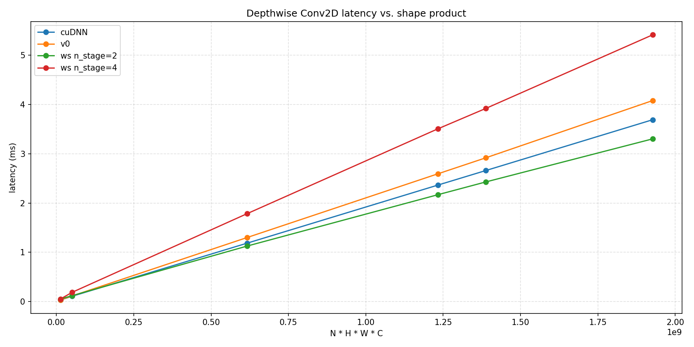

# TMA Depthwise Conv2D (NHWC) on Blackwell B200

针对 NVIDIA Blackwell B200 (sm_100) 编写的 **NHWC Depthwise Conv2D 前向** 实现，用于学习 **TMA (Tensor Memory Accelerator)**、`mbarrier` 以及 **warp-specialized 多级流水** 这些特性。

C++/CUDA 只负责 kernel；正确性校验和性能测试都用 PyTorch CUDA Extension 在 Python 侧驱动。

## 版本

| id | 说明 |
| -- | ---- |
| v0 | naive kernel，不走 smem、不走 TMA，用 `float4` 向量化读写 gmem |
| ws | TMA + warp specialization + 多级流水，`n_stage` 可配（支持 2/3/4） |

固定配置：
- fp16 输入 / fp32 累加 / fp16 输出
- `R = S = 3`, `stride = 1`, `padding` 任意（测试用 1）
- `BlockP = 8`, `BlockQ = 32`, `BlockC = 64`

## 安装


### 拉取仓库（含 submodule）

```bash
git clone <repo-url>
cd tma-depthwise-conv
git submodule update --init --recursive   # 拉 third_party/cutlass
```

或直接一步到位：`git clone --recursive <repo-url>`。

### 安装扩展

```bash
pip install -e . --no-build-isolation
```
## 单元测试

```bash
pytest tests/
```

## 性能测试

```bash
python -m tests.bench
```

运行结束后会在 `tests/bench.png` 生成四条曲线（cuDNN / v0 / ws n_stage=2 / ws n_stage=4）的耗时对比图。

### 测试环境

- GPU: NVIDIA B200 (sm_100)
- Driver: 580.95.05
- CUDA: 13.0 (driver) / 12.9 (nvcc toolkit)
- PyTorch: 2.9.1+cu129
- cuDNN: 9.10.2


